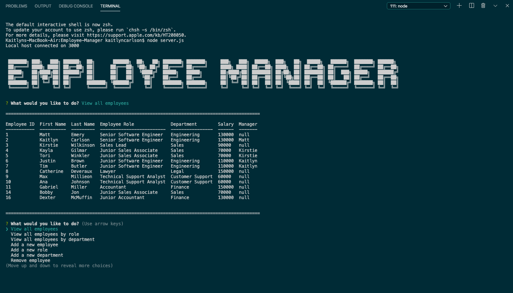

# Employee-Manager

A CMS, for employee management, utilizing Node.js, Inquirer, and MySQL to help users track, update, and delete employees from a database.



## Table of Contents

- [Purpose](#purpose)
- [User Story](#userstory)
- [Usability](#Usability)
- [Technologies](#technologies)
- [Status](#status)

## Purpose

## User Story

```
As a business owner
I want to be able to view and manage the departments, roles, and employees in my company
So that I can organize and plan my business
```

## Technologies

- Heroku
- Node.js
- Express
- Nodemon
- Path
- fs

## Usability

## Status
